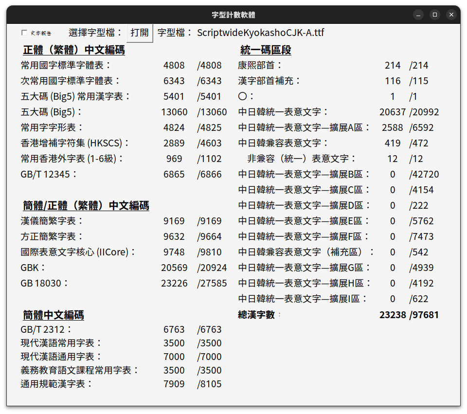
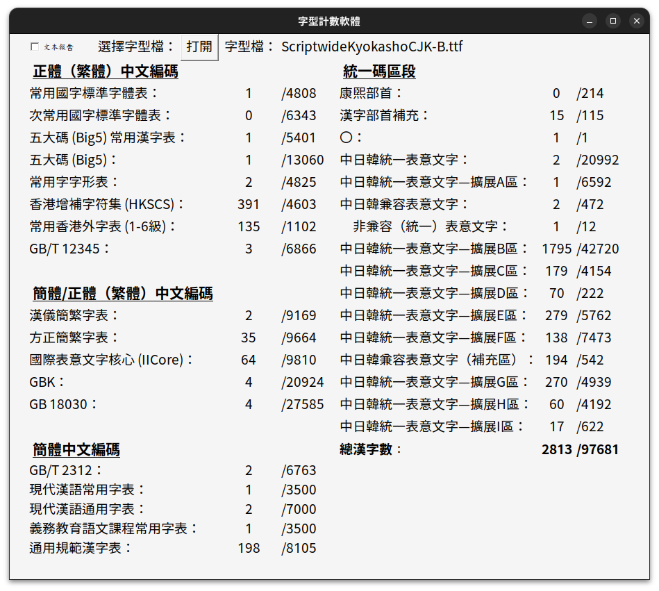

# Scriptwide Kyokasho CJK

> [!WARNING]  
> I added way too many glyphs to the font, but before I could save it, FontForge corrupted all of my saves, turning everything into zero bytes. No backups were made, so unfortunately many characters created over the span of a month are currently lost.

CJK font based on Klee One Semibold and its derivatives

This font is licensed under OFL.

## Description

Low effort amalgamation of several Klee One-derived fonts with some minute edits.

Glyphs do not necessarily follow any source, but most of them should follow the J-source or G-source.

Scriptwide Kyokasho CJK consists of 2 fonts to support as many CJK ideographs as possible.

## Coverage

These are screenshots from <https://github.com/NightFurySL2001/CJK-character-count>.

## Who asked?

1. Why does Scriptwide Kyokasho CJK consist of 2 fonts?
  * One font file can only support 65535 glyphs, therefore the font has to be split to accommodate future additions.
2. Why not 3 fonts?
  * Bad question.
3. Is this README file copied from Scriptwide Sans CJK?
  * Yes.
4. Can I expand on this font?
  * Yes, unless you violate the OFL. You probably won't if you're being reasonable.
5. Aren't there less characters compared to LXGW WenKai?
  * Those are AI placeholder characters produced through zi2zi. To maximise quality and to avoid confusion I have removed them. Newer glyphs may still be traced from these AI characters.
6. Why isn't this classified as a Kai font?
  * This is to differentiate the font from proper Kai fonts like TW-Kai. Contrary to popular belief, Klee One is more similar to kyokasho-tai compared to Kai script. However, kyokasho-tai itself is based on Kai script.

## Disclaimer

This is not a professional font.

Glyphs do not necessarily follow any source.

I am not responsible for any damages caused by misusage of this font, or any misunderstandings that may arise when it is used in any scenario.

If there are inaccuracies in certain glyphs, please create an issue.

## License

As stated above, these fonts are licensed under the Open Font License. Details can be found in [the license file](LICENSE) or [the OFL website](https://openfontlicense.org/).

This portion is partially taken from [the Plangothic repository](https://github.com/Fitzgerald-Porthmouth-Koenigsegg/Plangothic_Project/blob/main/README.en.md#license) and from the OFL website.

Note that the below is not a substitute for legal advice. Please refer to the OFL text for more details.

### You may:

* Install these fonts.
* Modify these fonts.
* Redistribute these fonts, modified or not. (Please ensure the modified font is licensed under the OFL, and does not use any OFL reserved names. Scriptwide itself is NOT a reserved name, but to prevent confusion, I do not recommend using the "Scriptwide" name in any derivative fonts.)
* Use these fonts for all kinds of design work, both commercial and non-commercial, free of charge, without notice or acknowledgement. (Though, credit is still appreciated.)

### You may not:

* Sell any part of the font files on their own.
  * There are many online merchants (typically on Taobao) illegally reselling OFL fonts. No matter the original creator of the fonts, please refrain from purchasing from these resellers, as sellings fonts directly is a serious violation of the OFL.
* Republish these fonts under a non-OFL license.
  * 鼎〇 (〇猎), I'm talking about you...
* Use these fonts for illegal purposes or those that harm the normal operation of computer systems.
  * I mean, you have common sense... right? 

## Credits

| Font | Brief Description | Author(s) |
| --- | --- | --- |
| [Klee One](https://fonts.google.com/specimen/Klee+One) | Base font of base font | Fontworks |
| [LXGW WenKai](https://github.com/lxgw/LxgwWenKai) | Base font | LXGW |
| [LXGW WenKai TC](https://github.com/lxgw/LxgwWenkaiTC) | Provided classical glyphs | LXGW |
| [YshiPen-Shuti](https://github.com/Steve-Yuu/YshiPen-Shuti) | Provided classical glyphs | Steve-Yuu |
| [Moon Stars Kai](https://github.com/GuiWonder/MoonStarsKai) | Provided classical glyphs | GuiWonder |
| [Iansui](https://github.com/ButTaiwan/iansui) | Provided some glyphs | But Ko |
| [JyunsaiKaai](https://github.com/ItMarki/jyunsaikaai) | Provided some glyphs | ItMarki |
| [PlanKai](https://github.com/Des-Magmeta/PlanKai) | Provided some glyphs | Des-Magmeta |
| [WenKai_MSARG](https://github.com/buwuzhengyedexiaoji/WenKai_MSARG) | Provided some glyphs | buwuzhengyedexiaoji |
| [Astalia](https://github.com/Ayaginu-Sue/Astalia) | Provided some glyphs | Ayaginu-Sue |
| [LXGW WenKai GB](https://github.com/lxgw/LxgwWenkaiGB) | Provided some glyphs | LXGW |
